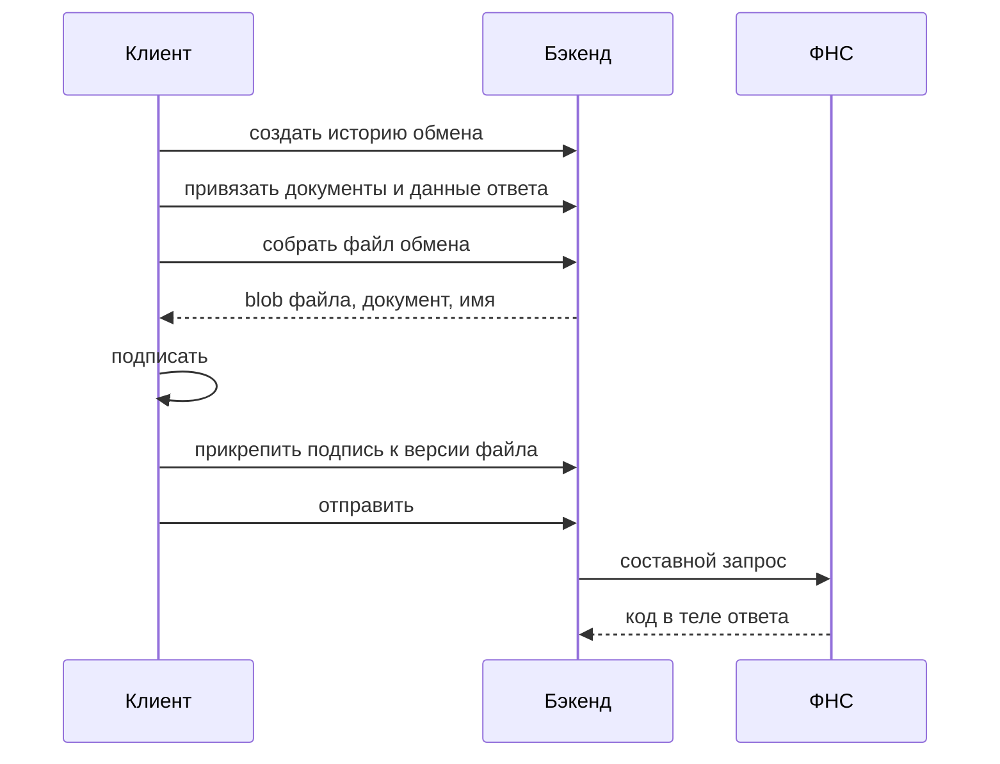

## Содержание

- [[#Содержание]]
- [[#Назначение]]
- [[#Разделение работы]]
- [[#Порядок отправки]]
- [[#Требования к клиенту]]
- [[#Пробелы]]

---

## Назначение

- Отвечает, что делает клиент, что бэкенд, и в каком порядке это обязано происходить.
- На выходе — понимание, почему сценарий не работает, если шаги переставить.
- Касается только исходящих сценариев. Входящие клиент не вызывает.
- **Не:**
	- Описывает внутренности бэкенда: это `docs/TRFTS/Поток обмена.md`.

[[#Содержание|↑ Назад]]

---

## Разделение работы

| Работа | Сторона | Почему так |
| --- | --- | --- |
| Решение отправить | Клиент | Инициатива у пользователя |
| Выбор документов и причин отказа | Клиент | Требует участия человека |
| Создание истории обмена | Клиент | Идентификатор нужен клиенту раньше вызовов |
| Сборка файла обмена | Бэкенд | Формат ФНС и версия схемы |
| Подписание файла | Клиент | Криптопровайдер и сертификат на рабочем месте |
| Проверка ЭП входящих | Клиент | Там же |
| Отправка и разбор ответа | Бэкенд | HTTP, токен, история обмена |

- Бэкенд подпись не создаёт и не проверяет. Он только сохраняет её и отдаёт по ссылке.
- Результат проверки ЭП в бэкенд не передаётся. Протокол отправляется только при успешной проверке, при неуспешной не отправляется вовсе.

[[#Содержание|↑ Назад]]

---

## Порядок отправки

Жёсткие требования к порядку:

1. История обмена создаётся первой: всё остальное привязывается к ней.
2. Документы и данные ответа записываются до сборки файла. Генератор читает их по истории обмена.
3. Файл обмена привязывается к истории после сборки. Привязка до сборки приведёт к тому, что файл попадёт в собственное содержимое.
4. Подпись прикрепляется до того, как ФНС придёт по ссылке. Для сборки файла она не нужна.

[[#Содержание|↑ Назад]]

---

## Требования к клиенту

- Вызывать только редиректор. Имя версионного пакета в клиенте не пишется, иначе смена версии потребует правки клиента.
- Идентификатор родителя — это история обмена, а не HTTP-запрос. Ошибка здесь тихая: файл соберётся без обязательных реквизитов требования.
- Файлы уходят байт в байт. Клиент формирует их сразу в нужной формату кодировке: бэкенд не перекодирует, иначе подпись перестанет сходиться.
- Номер пункта требования заполняется вручную и хранится в привязке документа.
- При повторной сборке на той же истории обмена прежний файл ответа остаётся привязанным и попадёт в новую сборку. Либо чистить привязку, либо метить файл ответа отдельным типом связи.

[[#Содержание|↑ Назад]]

---

## Пробелы

- Реквизиты подписанта и сведения о доверенности бэкенд не получает. Сейчас это заглушки в генераторе, источник данных не определён.
- Код документа по КНД для представляемых документов источника не имеет, стоит заглушка.
- Код клиента в репозитории не хранится. Описание восстановлено по сигнатурам и по переданным фрагментам скриптов.

[[#Содержание|↑ Назад]]
