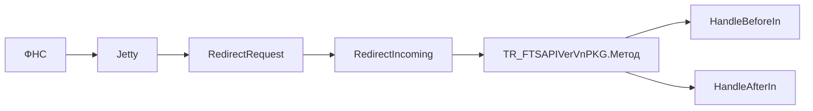
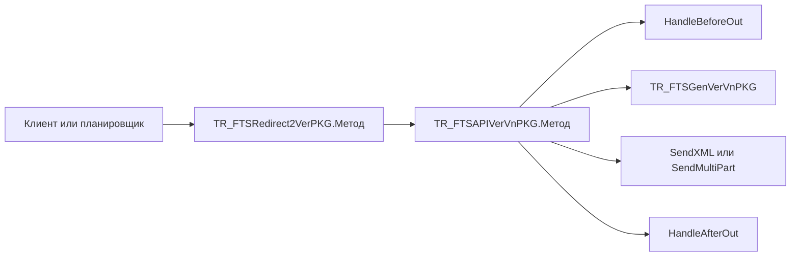

## Содержание

- [[#Содержание]]
- [[#Назначение]]
- [[#Входящий вызов]]
- [[#Исходящий вызов]]
- [[#Выбор версии]]
- [[#Скачивание файла]]
- [[#Коды и ошибки]]

---

## Назначение

- Отвечает, что происходит между вызовом и ответом в каждую сторону.
- На выходе — понимание, куда встраивать новый сценарий и где искать причину сбоя.
- **Не:**
	- Описывает, что остаётся в базе: это `docs/TRFTS/Данные обмена.md`.
	- Перечисляет методы сценариев: они в справочниках ФНС.

[[#Содержание|↑ Назад]]

---

## Входящий вызов

Порядок:

1. `RedirectRequest` пишет сырой запрос в журнал и разбирает адрес по сегментам: `cfg/N`, `api`, `vN`, метод. Первые две части необязательны.
2. По имени метода ищется функция обмена, из неё берётся имя оракловой функции.
3. `RedirectIncoming` собирает имя версионного пакета и вызывает реализацию динамически. Версия из адреса имеет приоритет над настройкой.
4. Реализация зовёт `HandleBeforeIn`: создаётся история обмена, тело кладётся в неё, проверяются `TicketId` и `InnNm`, обмен привязывается к цепочке.
5. Тело сценария разбирает реквизиты и валидирует их. При ошибке управление уходит к метке в конце функции.
6. `HandleAfterIn` пишет ответ и статус.
7. Функция возвращает тело ответа и заголовок типа содержимого.

Особенности:

- Валидация не прерывает обработку исключением. Ошибка ставит код и перепрыгивает к сборке ответа, поэтому ответ формируется всегда.
- Составной запрос разбирается до `HandleBeforeIn`: в историю обмена кладётся XML-часть, а не всё тело.
- Проверка `InnNm` отключается флагом. Служебный метод её не проходит.

[[#Содержание|↑ Назад]]

---

## Исходящий вызов

Порядок:

1. Вызывающий обращается к редиректору. Имя версионного пакета он не знает.
2. Редиректор собирает имя пакета по версии из настройки и вызывает реализацию динамически.
3. `HandleBeforeOut` создаёт или дополняет историю обмена, наследует цепочку от родительского обмена, копирует привязанные документы, выдаёт `TicketId`.
4. Тело сценария собирает XML или части составного запроса.
5. Отправка создаёт запись запроса, связывает её с историей обмена и уходит по адресу из настройки.
6. `HandleAfterOut` разбирает ответ и пишет код и текст статуса.

Особенности:

- Адрес получателя собирается только в одном месте и всегда с версией. Поля путей в конфигурации мертвы.
- Ошибка отправки гасится внутри: наружу поднимается пустой ответ, а не исключение. Статус станет `422`.
- Токен подставляется в заголовок по флагу, не автоматически.

[[#Содержание|↑ Назад]]

---

## Выбор версии

- Точка определения одна — `GetAPIVersion`. Другой быть не должно.
- Источник — пара «функция обмена + конфигурация обмена» в справочнике версий.
- Для входящих версия из адреса перекрывает настройку. Для исходящих настройка единственный источник.
- Версия родительского обмена не подставляется. Решение сознательное: ответ на ранее принятое сообщение уйдёт в версии из настройки.
- Реализованность версии не проверяется. Запрос версии без пакета падает на динамическом вызове.

Правило определения версии входящего, по приоритету:

1. Сегмент `api/vN` из адреса.
2. Настройка.

Разбор версии из namespace тела не реализован нигде.

[[#Содержание|↑ Назад]]

---

## Скачивание файла

- Служебный метод `getFileById` отдаёт файл или его подпись по GUID документа в адресе.
- Адрес собирается нами и кладётся в исходящие документы. ФНС приходит по нему отдельным запросом, позже основного обмена.
- Адрес строится без сегмента версии: метод вне версий API.
- Признак подписи — сегмент `sign` в пути. Он же сдвигает позицию GUID.
- Метод обязателен для сценариев, которые ссылаются на файлы. Без него ответ на требование бесполезен.

[[#Содержание|↑ Назад]]

---

## Коды и ошибки

- Код HTTP всегда `200`, если запрос доставлен. Настоящий код в теле, элемент `Status/Code`. Исключение — отладка.
- Любой отказ обязан нести код в теле. Пустое тело — дефект.
- Коды берутся из справочника кодов соответствующего приложения ФНС.
- `422` ставится, когда ответ не разобрался или пуст.
- Ошибка маршрутизации, неизвестная версия и краш реализации выглядят одинаково: в тело уходит `500` с общим текстом. Диагностика только в журнале.
- Ошибка вызова реализации перехватывается редиректором и превращается в текст ошибки с телом сгенерированного вызова.

[[#Содержание|↑ Назад]]
